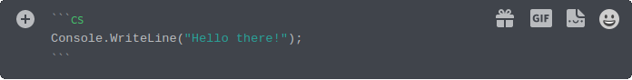
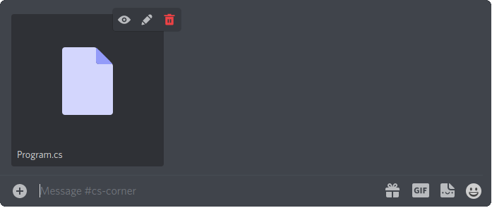
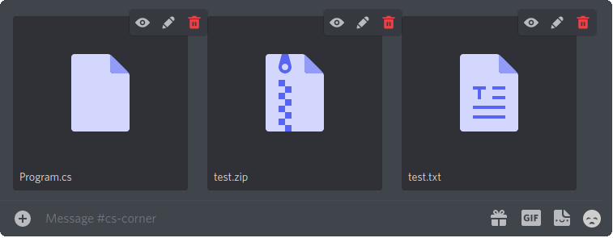

# .NET Discord Bot

## Info
The bot runs the recieved C# code in a docker container and redirects the process' standard in, out and error streams.\
The output stream is read line by line and sent back through the discord chat.\
If we send any messages in the chat while the process is already running the message will be sent to it's standard in.\
The process is given 30 seconds to run before it gets killed. If we send the "`^C`" message in chat the process gets a -SIGINT interrupt.

> The `OutputDataReceived` event may not recieve all data before the process exits.
> We may have to use `Thread.Sleep` or other means at the end of the code to make the process wait a bit before exiting.

To run the program: `dotnet run`

## Config files
- **discordbot.channels** - Stores the allowed discord channel ids. They can be cpoied from discord if developer mode is enabled.
- **discordbot.token** - Stores the bot's token. The file is not required, because the token can be provided via the `token=` argument like this: `dotnet run -- token=$TOKEN`.

## Running C# code
There are three ways to run C# code, but they can be used together.

## 1. Discord message
Send code in a cs code block.\

## 2. .cs files
Send the .cs and other files in a message. The message can contain multiple files.\

## 3. Zip files
Send zip files. Files extracted from zip files keep the original directory structure.\

